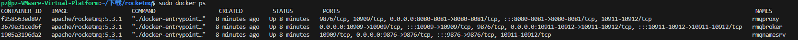

# rocketmq
使用docker-compose一键部署rocketmq


## 部署步骤

1. 修改namesrvAddr=自己的虚拟机或者云服务器的地址

2. 一键部署
```shell
sudo docker compose up -d
```

3. 接着查看是否部署成功

```shell
sudo docker ps
```




4. 使用Java简单验证是否部署成功

+ 导入依赖
```java
<?xml version="1.0" encoding="UTF-8"?>
<project xmlns="http://maven.apache.org/POM/4.0.0"
         xmlns:xsi="http://www.w3.org/2001/XMLSchema-instance"
         xsi:schemaLocation="http://maven.apache.org/POM/4.0.0 http://maven.apache.org/xsd/maven-4.0.0.xsd">
    <modelVersion>4.0.0</modelVersion>

    <groupId>org.tech</groupId>
    <artifactId>roctetmq</artifactId>
    <version>1.0-SNAPSHOT</version>

    <properties>
        <maven.compiler.source>23</maven.compiler.source>
        <maven.compiler.target>23</maven.compiler.target>
        <project.build.sourceEncoding>UTF-8</project.build.sourceEncoding>
    </properties>


    <dependencies>
            <dependency>
                <groupId>org.apache.rocketmq</groupId>
                <artifactId>rocketmq-client</artifactId>
                <version>5.3.1</version>
            </dependency>


    </dependencies>

</project>
```


+ 编写一个简单的main函数
```java 
package org.tech;

import org.apache.rocketmq.client.producer.DefaultMQProducer;
import org.apache.rocketmq.client.consumer.DefaultMQPushConsumer;
import org.apache.rocketmq.client.consumer.listener.ConsumeConcurrentlyContext;
import org.apache.rocketmq.client.consumer.listener.ConsumeConcurrentlyStatus;
import org.apache.rocketmq.client.consumer.listener.MessageListenerConcurrently;
import org.apache.rocketmq.client.producer.SendResult;
import org.apache.rocketmq.common.message.Message;
import org.apache.rocketmq.common.message.MessageExt;
import org.apache.rocketmq.common.consumer.ConsumeFromWhere;

import java.util.List;

public class Main {
    private static final String NAMESRV_ADDR = "192.168.196.128:9876";
    private static final String TOPIC = "TestTopic";
    private static final String PRODUCER_GROUP = "test-producer-group";
    private static final String CONSUMER_GROUP = "test-consumer-group";

    public static void main(String[] args) throws Exception {
        // 启动生产者
        testProducer();
        // 启动消费者
        testConsumer();
    }

    public static void testProducer() throws Exception {
        DefaultMQProducer producer = new DefaultMQProducer(PRODUCER_GROUP);
        producer.setNamesrvAddr(NAMESRV_ADDR);
        producer.start();
        System.out.println("开始发送");
        try {
            for (int i = 0; i < 10; i++) {
                Message msg = new Message(TOPIC, "TagA", 
                    ("Hello RocketMQ " + i + " at " + System.currentTimeMillis()).getBytes());
                SendResult sendResult = producer.send(msg);
                System.out.printf("发送第%d条消息，结果: %s%n", i+1, sendResult);
                Thread.sleep(1000); // 每秒发送一条
            }
        } finally {
            producer.shutdown();
        }
    }

    public static void testConsumer() throws Exception {
        DefaultMQPushConsumer consumer = new DefaultMQPushConsumer(CONSUMER_GROUP);
        consumer.setNamesrvAddr(NAMESRV_ADDR);
        consumer.setConsumeFromWhere(ConsumeFromWhere.CONSUME_FROM_FIRST_OFFSET);
        consumer.subscribe(TOPIC, "*");

        System.out.println("开始消费");

        consumer.registerMessageListener(new MessageListenerConcurrently() {
            @Override
            public ConsumeConcurrentlyStatus consumeMessage(
                    List<MessageExt> msgs, ConsumeConcurrentlyContext context) {
                for (MessageExt msg : msgs) {
                    System.out.printf("收到消息: %s%n", new String(msg.getBody()));
                }
                return ConsumeConcurrentlyStatus.CONSUME_SUCCESS;
            }
        });

        consumer.start();
        System.out.println("消费者已启动");
        
        // 让消费者运行一段时间
        Thread.sleep(5000);
        consumer.shutdown();
    }
}
```

